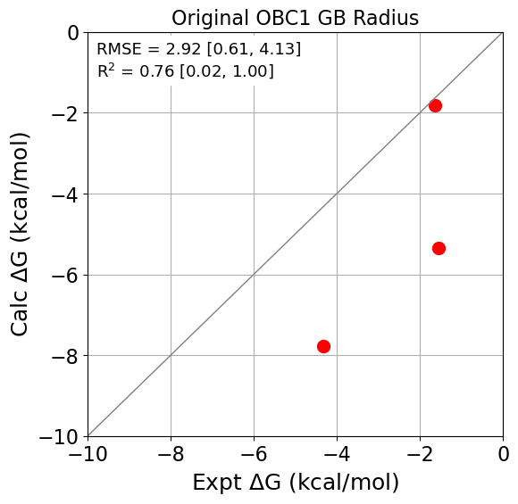
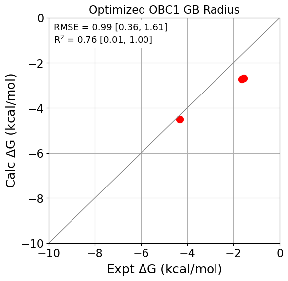

### Running Benchmark in Evaluator
Here, we will run an Evaluator calculation without ForceBalance. Please take a look at [run_binding_benchmark.py](original/run_binding_benchmark.py) to see the difference in setting up the calculations than in the optimization case.

Similarly to the optimization, run the following on the terminal to run the calculation:
```bash
python run_binding_benchmark.py &> console_output.log
```
for both the [original](original) and [optimized](optimized) parameters.

### Analyzing the output and results
Once complete, run the [jupyter notebook](plot_benchmark_results.ipynb) to analyze the results.

With the original GB radius, we see that the force field overestimates the binding free energy.

<p align="center">
  
</p>

With the optimized parameters, we get a significant improvement reducing the root-mean-squared-error (RMSE) from 2.92 kcal/mol to 0.99 kcal/mol. 
<p align="center">
  
</p>