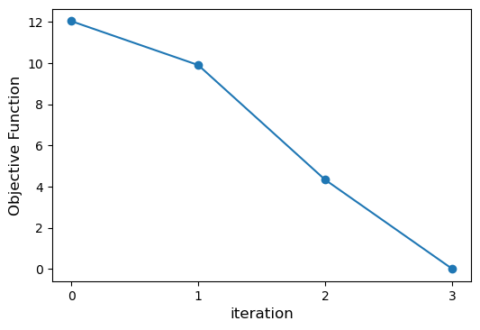
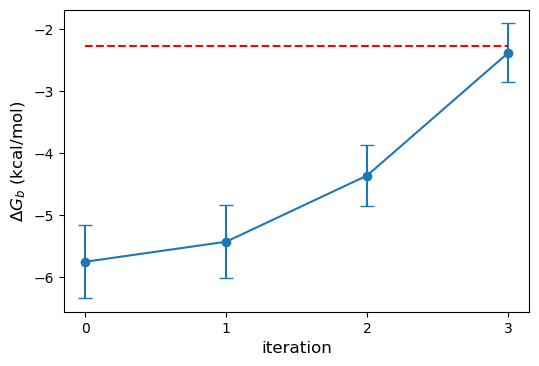
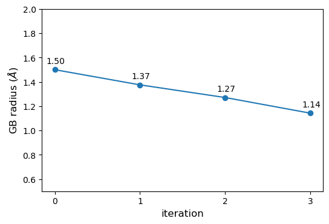

### Running ForceBalance optimization
Before running the optimization script, make sure you have your conda environment activated. 

```bash
conda activate openff-evaluator
```
---
**NOTE**

The input options for ForceBalance is defined in the configuration file [`optimize.in`](optimize.in). Please take a look at the ForceBalance [docs](https://leeping.github.io/forcebalance/doc/html/index.html) for more details.

---
Run the following either on your local machine or distributed cluster (see the Evaluator [docs](https://docs.openforcefield.org/projects/evaluator/en/latest/backends/daskbackends.html))

```bash
python optimization-FB-host-guest.py &> console_output.log
```

### Analyzing the output and results
Once the optimization is complete, you can use the [jupyter notebook](plot_forcebalance_results.ipynb) provided to extract and analyze the output from ForceBalance & OpenFF-Evaluator.

With my calculations, the optimization converged after three iterations. As shown on the plot below, the objective function reaches near zero at iteration 3.

<p align="center">
  
</p>

We can also look at the binding free energy to see how close the calculations get to the experimental data (red dashed line).

<p align="center">
  
</p>

The plot below tells use that in order to fit the experimental value for binding, the GB radius of oxygen needs to get smaller.
<p align="center">
  
</p>